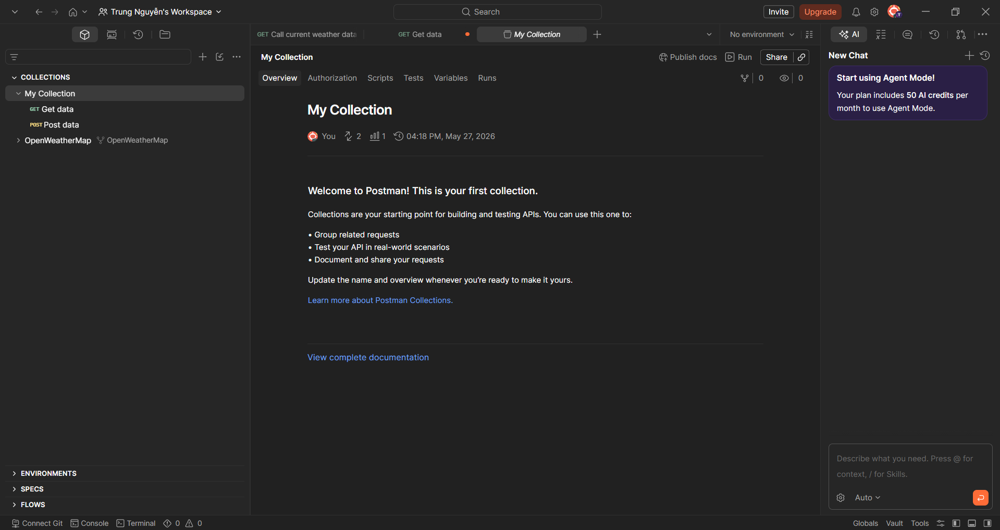
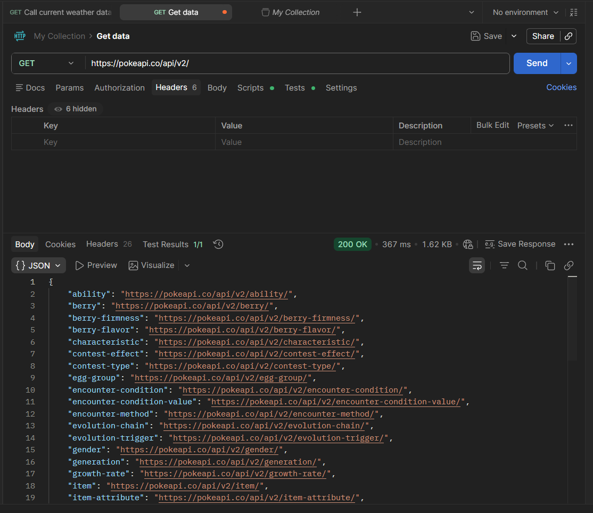
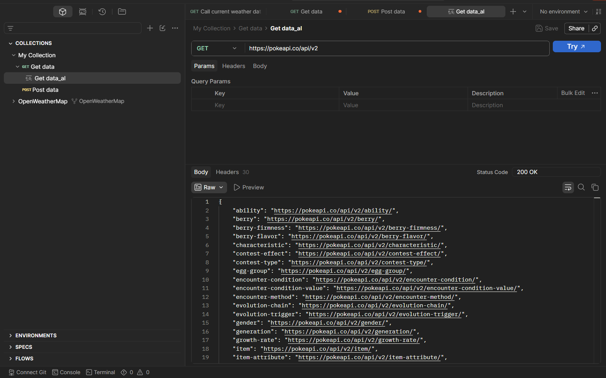
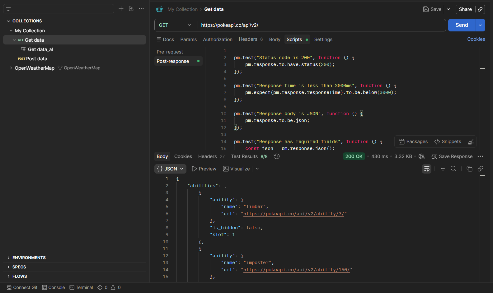

# Giới thiệu về Postman

Postman là một nền tảng toàn diện cho việc phát triển, sử dụng và quản lý API. Nó giúp các nhà phát triển và tester dễ dàng tạo, gửi, kiểm tra và chia sẻ các yêu cầu API. Postman hiện là một trong những công cụ phổ biến nhất trong lĩnh vực kiểm thử API.

**Tổng Quan**
- **Mục đích:** Hỗ trợ phát triển, kiểm thử và quản lý API một cách hiệu quả.
- **Đối tượng:** Nhà phát triển, tester, kỹ sư DevOps và nhóm QA.

**Tính năng chính**
- **Tạo yêu cầu HTTP:** Hỗ trợ nhiều phương thức (GET, POST, PUT, DELETE, v.v.), cho phép cấu hình URL, header, body và tham số.
- **Gửi yêu cầu & xem phản hồi:** Hiển thị mã trạng thái HTTP, header, body và nội dung phản hồi để phân tích nhanh.
- **Kiểm tra API:** Cung cấp trình soạn thảo JSON, bộ xác minh JSON, scripting để viết kiểm tra tự động và gỡ lỗi.
- **Quản lý bộ sưu tập (Collections):** Gom nhóm các yêu cầu thành bộ sưu tập để tái sử dụng và chia sẻ.
- **Chia sẻ & cộng tác:** Chia sẻ yêu cầu, bộ sưu tập và môi trường với đồng đội, hỗ trợ làm việc nhóm.
- **Quản lý môi trường:** Tạo và chuyển đổi giữa nhiều môi trường (dev, staging, prod) bằng biến môi trường.
- **Tự động hóa:** Hỗ trợ chạy bộ sưu tập theo kịch bản, tích hợp CI/CD và lập lịch kiểm thử tự động.
- **Bảo mật:** Hỗ trợ các cơ chế xác thực và ủy quyền (API keys, OAuth, Bearer Token, v.v.).

**Giao diện (Overview)**

- **Thanh điều hướng trái:** Nơi quản lý Collections, APIs, Environments và Workspaces.
- **Khu vực tạo yêu cầu:** Trình soạn thảo URL, phương thức, header, body và tham số.
- **Bảng kết quả phản hồi:** Hiển thị trạng thái, header và nội dung trả về (JSON, XML, văn bản).
- **Console & Runner:** Console giúp debug, Runner cho phép chạy bộ sưu tập và xem báo cáo kết quả.

**Hướng dẫn sử dụng cơ bản**
    Với The Pokemon API.

1. Tạo một request mới, chọn phương thức HTTP và nhập URL.

2. Gửi request và kiểm tra phần phản hồi trong bảng kết quả.

3. Lưu request vào một Collection để tái sử dụng.

4. Viết các test script nhỏ trong tab "Tests" để xác thực phản hồi tự động.

